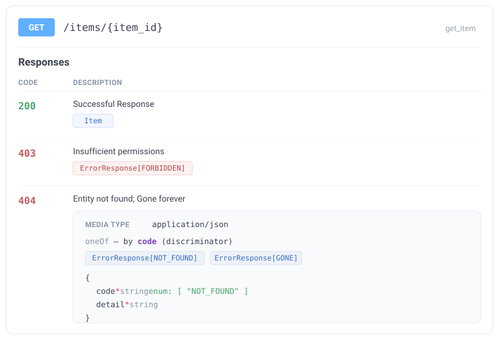

# Quickstart

In a few minutes: declare errors, register the handler, use them in a route and get a typed OpenAPI.

## 1. Declare codes and error classes

An error code is any member of your `StrEnum` (or a bare `Literal["CODE"]`). A class only needs to declare `http_status`; the metaclass derives the rest.

```python
from enum import StrEnum
from http import HTTPStatus
from typing import Literal

from fastapi_typed_errors import BaseError


class ErrorCode(StrEnum):
    NOT_FOUND = "NOT_FOUND"
    FORBIDDEN = "FORBIDDEN"


class NotFoundError(BaseError[Literal[ErrorCode.NOT_FOUND]]):
    http_status = HTTPStatus.NOT_FOUND
    description = "Requested entity does not exist"  # (1)!


class ForbiddenError(BaseError[Literal[ErrorCode.FORBIDDEN]]):
    http_status = HTTPStatus.FORBIDDEN
```

1. `description` is optional; it is used as the default `detail` and as the status description in OpenAPI.

## 2. Register the handler

Explicitly, the FastAPI way — just like `app.add_middleware(...)`. The package does nothing behind your back.

```python
from fastapi import FastAPI
from fastapi_typed_errors import BaseError, handle_base_error

app = FastAPI()
app.add_exception_handler(BaseError, handle_base_error)
```

!!! tip "Why `BaseError` rather than each class"

    Starlette resolves handlers by walking the exception's `__mro__`, so one handler on `BaseError` covers every subclass while leaving plain `HTTPException` alone.

## 3. Wrap the router and declare errors in the annotation

`with_errors` returns the **same** router and teaches it to understand the `Raises` marker in the return annotation.

```python
from typing import Annotated

from fastapi import APIRouter
from pydantic import BaseModel

from fastapi_typed_errors import Raises, with_errors


class Item(BaseModel):
    item_id: int


router = with_errors(APIRouter())


@router.get("/items/{item_id}")
def get_item(item_id: int) -> Annotated[Item, Raises[NotFoundError, ForbiddenError]]:
    if item_id == 0:
        raise NotFoundError(f"No item {item_id}")
    return Item(item_id=item_id)


app.include_router(router)
```

## 4. The result

The error response body always has the shape `{code, detail}`:

```json
{ "code": "NOT_FOUND", "detail": "No item 0" }
```

And in OpenAPI the route gets one entry per status — with an **exact** `Literal` code and a body model. Here is how it renders in Swagger UI:

{ .fte-shot }

Under the hood it is exactly the OpenAPI that Swagger renders:

=== "route responses"

    ```json
    {
      "404": {
        "description": "Requested entity does not exist",
        "content": {
          "application/json": {
            "schema": { "$ref": "#/components/schemas/ErrorResponse_Literal_NOT_FOUND__" }
          }
        }
      },
      "403": {
        "description": "Forbidden",
        "content": {
          "application/json": {
            "schema": { "$ref": "#/components/schemas/ErrorResponse_Literal_FORBIDDEN__" }
          }
        }
      }
    }
    ```

=== "component schema"

    ```json
    {
      "ErrorResponse[NOT_FOUND]": {
        "type": "object",
        "required": ["code", "detail"],
        "properties": {
          "code": { "type": "string", "const": "NOT_FOUND" },
          "detail": { "type": "string" }
        }
      }
    }
    ```

The key part — `code` is typed as `const: "NOT_FOUND"`: the client sees the **exact** value, not "just a string". Several errors on one status automatically become a discriminated `oneOf` union on `code` (like the `404` in the illustration above) — Swagger UI shows a variant picker by code value.

!!! tip "Check it yourself"

    ```python
    responses = app.openapi()["paths"]["/items/{item_id}"]["get"]["responses"]
    assert responses["404"]["content"]["application/json"]["schema"]["$ref"].endswith("NOT_FOUND__")
    ```

## Next

- Don't want to write markers at all? Turn on [`auto=True`](guide/decorator.md#auto) — the errors are found statically.
- Want a guarantee that what's declared matches reality? Set up the [CI check](guide/checker.md).
- Get to grips with the [core](guide/core.md): how `BaseError`, `error_models` and the handler work.
