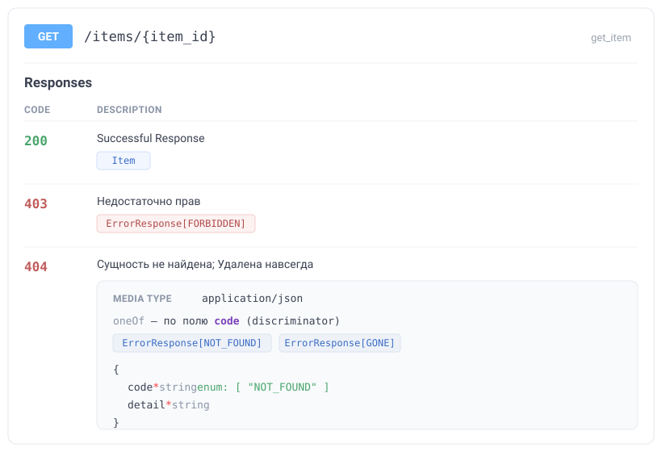

# Быстрый старт

За несколько минут: объявить ошибки, зарегистрировать обработчик, использовать в роуте и получить типизированный OpenAPI.

## 1. Объявите коды и классы ошибок

Код ошибки — любой член вашего `StrEnum` (или голый `Literal["CODE"]`). В классе достаточно объявить `http_status`; всё остальное выводит метакласс.

```python
from enum import StrEnum
from http import HTTPStatus
from typing import Literal

from fastapi_typed_errors import BaseError


class ErrorCode(StrEnum):
    NOT_FOUND = "NOT_FOUND"
    FORBIDDEN = "FORBIDDEN"


class NotFoundError(BaseError[Literal[ErrorCode.NOT_FOUND]]):
    http_status = HTTPStatus.NOT_FOUND
    description = "Запрошенная сущность не найдена"  # (1)!


class ForbiddenError(BaseError[Literal[ErrorCode.FORBIDDEN]]):
    http_status = HTTPStatus.FORBIDDEN
```

1. `description` — необязателен; используется как `detail` по умолчанию и как описание статуса в OpenAPI.

## 2. Зарегистрируйте обработчик

Явно, в стиле FastAPI — так же, как `app.add_middleware(...)`. Пакет ничего не делает за вашей спиной.

```python
from fastapi import FastAPI
from fastapi_typed_errors import BaseError, handle_base_error

app = FastAPI()
app.add_exception_handler(BaseError, handle_base_error)
```

!!! tip "Почему `BaseError`, а не каждый класс отдельно"

    Starlette ищет обработчик, обходя `__mro__` исключения, поэтому один обработчик на `BaseError` покрывает все подклассы, не трогая обычные `HTTPException`.

## 3. Оберните роутер и объявите ошибки в аннотации

`with_errors` возвращает **тот же** роутер и учит его понимать маркер `Raises` в return-аннотации.

```python
from typing import Annotated

from fastapi import APIRouter
from pydantic import BaseModel

from fastapi_typed_errors import Raises, with_errors


class Item(BaseModel):
    item_id: int


router = with_errors(APIRouter())


@router.get("/items/{item_id}")
def get_item(item_id: int) -> Annotated[Item, Raises[NotFoundError, ForbiddenError]]:
    if item_id == 0:
        raise NotFoundError(f"Нет элемента {item_id}")
    return Item(item_id=item_id)


app.include_router(router)
```

## 4. Что получилось

Ответ об ошибке всегда имеет форму `{code, detail}`:

```json
{ "code": "NOT_FOUND", "detail": "Нет элемента 0" }
```

А в OpenAPI роут получает по записи на каждый статус — с **точным** `Literal`-кодом и моделью тела. Вот как это отображается в Swagger UI:

{ .fte-shot }

Под капотом это ровно тот OpenAPI, который рендерит Swagger:

=== "responses роута"

    ```json
    {
      "404": {
        "description": "Запрошенная сущность не найдена",
        "content": {
          "application/json": {
            "schema": { "$ref": "#/components/schemas/ErrorResponse_Literal_NOT_FOUND__" }
          }
        }
      },
      "403": {
        "description": "Forbidden",
        "content": {
          "application/json": {
            "schema": { "$ref": "#/components/schemas/ErrorResponse_Literal_FORBIDDEN__" }
          }
        }
      }
    }
    ```

=== "схема компонента"

    ```json
    {
      "ErrorResponse[NOT_FOUND]": {
        "type": "object",
        "required": ["code", "detail"],
        "properties": {
          "code": { "type": "string", "const": "NOT_FOUND" },
          "detail": { "type": "string" }
        }
      }
    }
    ```

Ключевое — `code` типизирован как `const: "NOT_FOUND"`: клиент видит **точное** значение, а не «просто строку». Несколько ошибок на одном статусе автоматически становятся discriminated `oneOf`-union по `code` (как `404` на иллюстрации выше) — Swagger UI покажет выбор варианта по значению кода.

!!! tip "Проверить самому"

    ```python
    responses = app.openapi()["paths"]["/items/{item_id}"]["get"]["responses"]
    assert responses["404"]["content"]["application/json"]["schema"]["$ref"].endswith("NOT_FOUND__")
    ```

## Дальше

- Хотите вообще не писать маркеры? Включите [`auto=True`](guide/decorator.md#auto) — ошибки найдутся статически.
- Хотите гарантию, что задекларированное совпадает с реальностью? Настройте [CI-проверку](guide/checker.md).
- Разберитесь с [ядром](guide/core.md): как устроены `BaseError`, `error_models` и обработчик.
